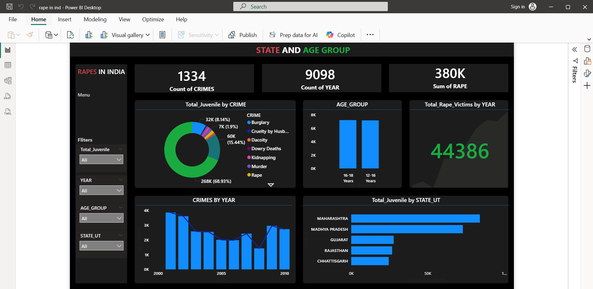
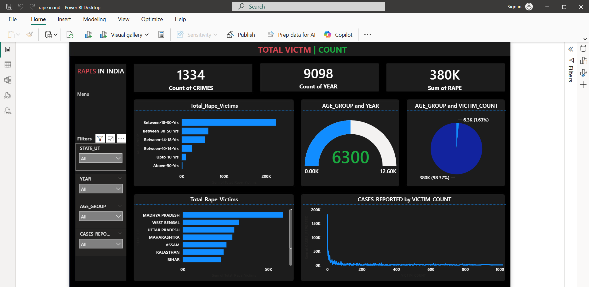
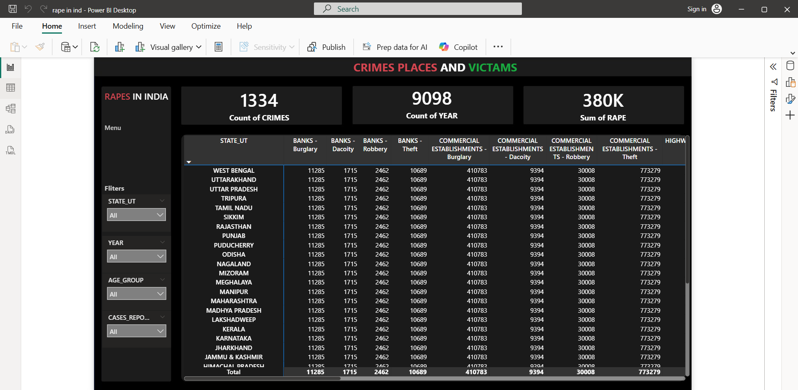

# India Crime Data Analysis

## Business Question
Which states have the highest crime rates and
how have crime patterns changed over the years?

## Tools Used
Power BI | Excel

## Dataset
Government of India crime statistics —
district-wise crimes, juvenile data,
victims data across multiple years

## Key Findings
- Uttar Pradesh — highest bar
- 2021 — peak year
- Increased by about 30% from 2018 to 2021

## Dashboard

## Files
- [Crime Data Analysis Dashboard India.pbix](https://github.com/sandeep-sandy123/Crime-Data-Analysis-Dashboard-India-Power-BI/blob/main/Crime%20Data%20Analysis%20Dashboard%20India.pbix)
- [CRIMES_BY_PLACES.csv](https://github.com/sandeep-sandy123/Crime-Data-Analysis-Dashboard-India-Power-BI/blob/main/CRIMES%20BY%20PLACES.csv)
- [DISTRICT_WISE_CRIMES.csv](https://github.com/sandeep-sandy123/Crime-Data-Analysis-Dashboard-India-Power-BI/blob/main/DISTRICT_WISE_CRIMES.csv)
- [JUVENILE_APPREHENDED.csv](https://github.com/sandeep-sandy123/Crime-Data-Analysis-Dashboard-India-Power-BI/blob/main/JUVENILE_APPREHENDED.csv)
- [VICTIMS_OF_RAPE.csv](https://github.com/sandeep-sandy123/Crime-Data-Analysis-Dashboard-India-Power-BI/blob/main/VICTIMS_OF_RAPE.csv)
